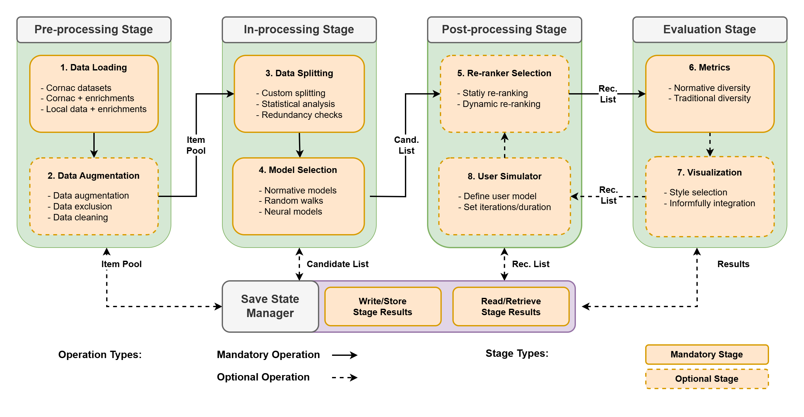

# Informfully Recommenders


Welcome to Informfully ([GitHub](https://github.com/orgs/Informfully) & [Website](https://informfully.ch/))!
Informfully is an open-source reproducibility platform for content distribution and user experiments.

To view the full documentation, please visit [Informfully at Read the Docs](https://informfully.readthedocs.io/).
It is the combined documentation for all [code repositories](https://github.com/orgs/Informfully/repositories).

**Links and Resources:** [GitHub](https://github.com/orgs/Informfully) | [Website](https://informfully.ch) | [X](https://x.com/informfully) | [Documentation](https://informfully.readthedocs.io) | [DDIS@UZH](https://www.ifi.uzh.ch/en/ddis.html) | [Google Play](https://play.google.com/store/apps/details?id=ch.uzh.ifi.news) | [App Store](https://apps.apple.com/us/app/informfully/id1460234202)

## Pipeline Overview

Informfully Recommenders is a norm-aware extension of [Cornac](https://github.com/PreferredAI/cornac).
Please see the [Experiments Repository](https://github.com/Informfully/Experiments) for an overview of our past offline and online studies using this framework as back end.
And see the [Online Tutorial](https://github.com/Informfully/Experiments/tree/main/experiments/tutorial) for a quick introduction on how to use this repository.


<p align="center"><i>Overview of the Informfully Recommenders Pipeline</i></p>

Please find below an overview datasets, models, re-rankers, and metrics for which we provide out-of-the-box support (these are in addition to what is already supported by Cornac).

### Dataset List

| Model           | Description                           | Source    |
|-----------------|---------------------------------------|-----------|
| EB-NeRD         | Danish News Dataset                   | [Website](https://recsys.eb.dk)                                             |
| MIND            | English (US) News Dataset             | [Website](https://msnews.github.io/index.html)                              |
| NeMig           | German News Dataset                   | [Website](https://github.com/andreeaiana/nemig)                             |

### Model List

| Model           | Description                           | Source    |
|-----------------|---------------------------------------|-----------|
| PLD             | Participatory Diversity               | [Paper](https://www.tandfonline.com/doi/full/10.1080/21670811.2021.2021804) |
| EPD             | Deliberative Diversity                | [Paper](https://dl.acm.org/doi/abs/10.1145/3604915.3608834)                 |
| D-RDW           | Diversity-Driven Random Walks         | TBA                                                                         |
| RP3-β           | Random Walk                           | [Paper](https://dl.acm.org/doi/abs/10.1145/2792838.2800180)                 |
| RWE-D           | Random Walk with Erasure              | [Paper](https://dl.acm.org/doi/abs/10.1145/3442381.3449970)                 |

### Re-ranker List

| Re-ranker       | Description                           | Source    |
|-----------------|---------------------------------------|-----------|
| G-KL            | G-KL (static re-ranking)              | [Paper](https://dl.acm.org/doi/abs/10.1145/3240323.3240372)                 |
| PM-2            | PM-2 (static re-ranking)              | [Paper](https://dl.acm.org/doi/abs/10.1145/2348283.2348296)                 |
| MMR             | MMR (static re-ranking)               | [Paper](https://dl.acm.org/doi/pdf/10.1145/290941.291025)                   |

### Metrics List

| Metric          | Description                           | Source    |
|-----------------|---------------------------------------|-----------|
| GINI            | Gini Coefficinet                      | [Paper](https://link.springer.com/chapter/10.1007/978-1-0716-2197-4_16)     |
| ILD             | Intra-lList Distance                  | [Paper](https://api.semanticscholar.org/CorpusID:11075976)                  |
| RADio           | RADio Metrics                         | [Paper](https://dl.acm.org/doi/abs/10.1145/3523227.3546780)                 |

## Citation

If you use any code or data of this repository in a scientific publication, we ask you to cite the following paper:

- [Multi-Modal Recommender Systems: Hands-On Exploration](http://jmlr.org/papers/v21/19-805.html), Truong *et al.*, Proceedings of the 15th ACM Conference on Recommender Systems, 2021.

  ```
  @inproceedings{truong2021multi,
    title={Multi-modal recommender systems: Hands-on exploration},
    author={Truong, Quoc-Tuan and Salah, Aghiles and Lauw, Hady},
    booktitle={Fifteenth ACM Conference on Recommender Systems},
    pages={834--837},
    year={2021}
  }

- [Informfully - Research Platform for Reproducible User Studies](https://dl.acm.org/doi/10.1145/3640457.3688066), Heitz *et al.*, Proceedings of the 18th ACM Conference on Recommender Systems, 2024.

  ```
  @inproceedings{heitz2024informfully,
    title={Informfully - Research Platform for Reproducible User Studies},
    author={Heitz, Lucien and Croci, Julian A and Sachdeva, Madhav and Bernstein, Abraham},
    booktitle={Proceedings of the 18th ACM Conference on Recommender Systems},
    pages={660--669},
    year={2024}
  }
  ```

## Contributing
Your are welcome to contribute to the Informfully ecosystem and become a part of our community. Feel free to:
  - fork any of the [Informfully repositories](https://github.com/Informfully)
  - join and write on the [dicussion board](https://github.com/orgs/Informfully/discussions)
  - make changes and create pull requests

Please post your feature requests and bug reports in our [GitHub issues](https://github.com/Informfully/Documentation/issues) section.

## License
Released under the [Apache License 2.0](LICENSE). (Please note that the respective copyright licenses of third-party libraries and dependencies apply.)


